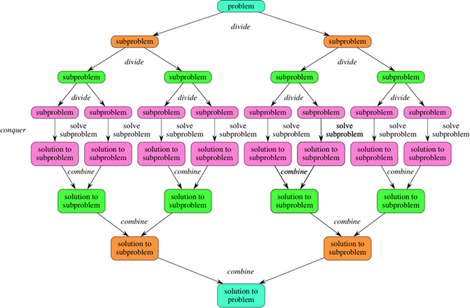
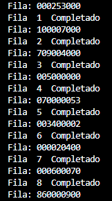
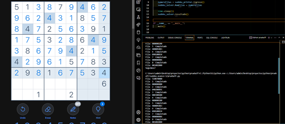
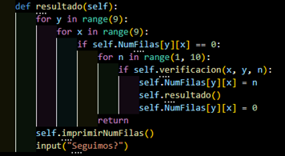
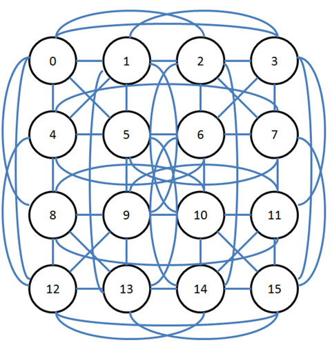

 
 
 

  

 

<strong>UNIVERSIDAD PERUANA DE CIENCIAS APLICADAS</strong>

 

<strong>TRABAJO FINAL</strong>

 

<strong>Curso: Complejidad Algorítmica</strong>

 

<strong>Sección: WS6B</strong>

 

<strong>Docente: Canaval Sánchez, Luis Martín</strong>

 

<strong>Integrantes:</strong>

 

<strong>Méndez López, Sebastián Alonso – U202211561</strong>

 

<strong>Centurión Quintana, Henry Manuel – U20221A339</strong>

 

<strong>Rolando Mochcco, Yordy - U201923959</strong>

 

 
 

 
 
 

## Tabla de Contenido

 
 

  1. [Descripción del problema](#1-descripción-del-problema)  
  1.1. [Descripción](#11-descripción) 
  1.2. [Fundamentación del problema](#12-fundamentación-del-problema) 
  1.2.1. [Algoritmo de Backtracking](#121-algoritmo-de-backtracking) 
  1.2.2. [Algoritmo de divide y vencerás](#122-algoritmo-de-divide-y-vencerás) 
  2. [Descripción y visualización del conjunto de datos](#2-descripción-y-visualización-del-conjunto-de-datos) 
  2.1. [Descripción del conjunto de datos](#21-descripción-del-conjunto-de-datos) 
  2.2. [Representación mediante grafos](#22-representación-mediante-grafos) 
  3. [Propuesta](#3-propuesta) 
  4. [Diseño de la aplicación](#4-diseño-de-la-aplicación) 
     4.1. [Análisis de requerimientos](#41-análisis-de-requerimientos) 
     4.2. [Especificación](#42-especificación) 
     4.3. [Diseño y arquitectura](#43-diseño-y-arquitectura) 
     4.4. [Programación](#44-programación) 
     4.5. [Análisis de complejidad](#45-análisis-de-complejidad) 
  5. [Validación de resultados y pruebas](#5-validación-de-resultados-y-pruebas) 
  6. [Conclusiones](#6-conclusiones) 
  7. [Bibliografía](#7-bibliografía)

 
 
 
 
 

## 1. Descripción del problema

En el presente documento se hablará sobre la descripción y fundamentación del problema citando fuentes.

### 1.1. Descripción

En el ámbito de la programación, se encuentran diversas herramientas y enfoques destinados a abordar problemas específicos, pero no todos resultan igualmente efectivos. El problema que nos compete en este proyecto radica en la creación de un sistema interactivo capaz de generar y resolver Sudokus de tamaño n x n. Un Sudoku es un acertijo lógico y numérico donde el objetivo es rellenar una cuadrícula de dimensión n x n de tal manera que cada fila, cada columna y cada subcuadrícula de tamaño n x n contenga todos los números del 1 al n exactamente una vez. El Sudoku es un problema ampliamente reconocido en el campo de la informática y la teoría de la complejidad. Según Johan Ekström y Kristofer Pitkäjärvi (2014), se ha demostrado que resolver un Sudoku es NP-completo (Nondeterministic Polynomial time), lo que impone limitaciones sustanciales a la capacidad de resolver Sudokus a medida que aumenta la complejidad. Aunque los Sudokus de órdenes bajos (3x3, 4x4) generalmente no presentan un desafío computacional en la actualidad, lograr implementaciones eficientes para resolverlos puede servir como demostración de concepto para otros algoritmos similares diseñados para resolver problemas NP-completos. En este sentido, hallar algoritmos eficientes para la resolución de Sudokus puede sentar precedentes para el desarrollo de otros algoritmos.

### 1.2. Fundamentación del problema

Aplicación en la Vida Real: Los Sudokus son una forma popular de entretenimiento y desafío lógico que se encuentra en periódicos, revistas y aplicaciones móviles. Además de su popularidad en el ámbito recreativo, se utilizan en la enseñanza de la lógica y la resolución de problemas. La generación y resolución de Sudokus son procesos relevantes en la creación de contenidos para estos propósitos.

Representación como Grafo: Un Sudoku se puede representar como un grafo, donde cada celda es un nodo y las restricciones de fila, columna y sub cuadrícula se traducen en arcos entre los nodos. Esto permite la aplicación de algoritmos de búsqueda y técnicas de resolución de grafos para encontrar soluciones válidas.

Búsqueda y Resolución: Resolver Sudokus es un problema NP-completo, lo que significa que encontrar una solución puede ser costoso computacionalmente. Esto brinda una oportunidad para explorar diversas técnicas de búsqueda, como búsqueda en profundidad, búsqueda en anchura, búsqueda heurística y búsqueda en ramificación y poda. Los algoritmos de resolución deben ser eficientes para manejar Sudokus de tamaños variables.

En conclusión, para resolver el problema necesitamos entender el algoritmo backtracking y el algoritmo de divide y vencerás.

#### 1.2.1. Algoritmo de backtracking

El algoritmo de backtracking es utilizado para encontrar soluciones a problemas combinatorios, en los que se busca una combinación de elementos que cumpla ciertas restricciones. Es especialmente útil para

 problemas donde se necesita explorar diferentes posibilidades en un árbol de decisiones y encontrar la combinación óptima o una solución válida. El algoritmo de backtracking funciona a través de pasos recursivos en los que se toman decisiones en cada etapa, se exploran las posibles soluciones y se revierten esas decisiones si no llevan a una solución válida. Si se encuentra una solución válida, se devuelve; si no, se retrocede (de ahí el nombre) y se prueban otras opciones. Este tipo de algoritmo se utiliza en una variedad de problemas, como la resolución de laberintos, la generación de combinaciones o permutaciones, el Sudoku, la coloración de grafos, entre otros. Es especialmente valioso para problemas que implican una búsqueda exhaustiva en un espacio de soluciones, donde se necesita explorar múltiples combinaciones posibles de manera eficiente y encontrar la solución óptima o válida.

  

#### 1.2.2. Algoritmo de divide y vencerás

El algoritmo de "divide y vencerás" es una técnica de diseño algorítmico que se utiliza para resolver problemas complejos al descomponerlos en subproblemas más pequeños, más fáciles de resolver. La idea central es dividir el problema principal en subproblemas más simples, resolverlos de forma independiente y luego combinar sus soluciones para obtener la solución al problema original.

Algunos de los ejemplos comunes en los que se aplica la técnica de "divide y vencerás" incluyen:

1. **Ordenamiento**: Algoritmos de ordenamiento como Merge Sort y Quick Sort utilizan esta técnica para dividir el arreglo en subarreglos, ordenarlos individualmente y luego combinarlos en un arreglo ordenado.

2. **Multiplicación de matrices**: El algoritmo de Strassen para multiplicación de matrices aplica "divide y vencerás" para dividir la multiplicación de matrices en subproblemas más pequeños.

3. **Problemas de búsqueda en árboles o grafos**: Algoritmos como el recorrido de árboles (por ejemplo, el recorrido inorden, preorden, postorden) y búsqueda binaria en árboles binarios de búsqueda (BST) aplican la técnica de "divide y vencerás" para explorar y procesar subárboles.

Esta técnica es valiosa porque puede ayudar a reducir la complejidad de tiempo de algoritmos y hacer que la solución sea más eficiente. Sin embargo, es importante elegir una estrategia de combinación adecuada y garantizar que los subproblemas sean realmente más simples de resolver que el problema original para que la técnica sea efectiva.

  

 
 
 
 
 

## 2. Descripción y visualización del conjunto de datos

Los datos se han sacado desde páginas web, donde el sudoku creado, genera muchas posibilidades con lo cual nuestro bot busca la solución al problema tomando las delimitaciones correspondientes de una matriz 9 x 9.
Al evaluar la matriz, el algoritmo tiene que ir de izquierda a derecha hasta llegar a 8 (0 a 8), al llegar a 8, regresa 9 pasos a la izquierda y baja un solo paso, para seguir con esa secuencia y así terminar con el proceso.

### 2.1. Descripción del conjunto de datos

Los datos generados, se generan en la función resultado(), el cual analiza la matriz entrante y de acuerdo a eso, llama a las validaciones para ver si se puede generar esa solucion y así hasta que encuentre.
Resaltar que, al ser una matriz de 9 x 9, las soluciones pueden ser pocas al ser del 1 al 9 y solo comparando números en vertical y horizontal.

+ Datos guardados:

  

+ Datos generados en el sudoku:

  

+ Función que genera los datos y verifica llamanda a la función verificado()

  

### 2.2. Representación mediante grafos

Representar un sudoku mediante un grafo es posible utilizando una estructura de datos que modele las relaciones entre los elementos del sudoku de manera adecuada. Una forma común de hacerlo es utilizando un grafo bipartito, donde hay dos conjuntos de vértices: uno para las celdas del sudoku y otro para los números posibles en cada celda.

A continuación daremos un enfoque general para representar un sudoku como un grafo:

+ Crear vértices para celdas y números:

Cada celda del sudoku se representa como un vértice en un conjunto.
Cada número posible en cada celda también es un vértice, en otro conjunto.

+ Establecer aristas entre celdas y números:

Para cada celda, conectarla con los números posibles para esa celda.
También puedes conectar las celdas que están en la misma fila, columna y bloque (subgrids 3x3 en un sudoku clásico) entre sí.

  

 
 
 
 
 

## 3. Propuesta

+ Debemos representar el Sudoku 16x16 en una estructura de datos adecuada. Utilizaremos una matriz 2D para representar el tablero, donde cada celda puede contener un número del 1 al 16. También es importante representar los números iniciales (pistas) y las celdas vacías.

+ Desarrollaremos una función que verificará si un número se puede colocar en una celda en función de las reglas del Sudoku. Esto incluye verificar la fila, la columna y el bloque 4x4 al que pertenece la celda.

+ Utilizaremos el algoritmo de backtracking para resolver el Sudoku. Comenzaremos en la primera celda vacía y, para cada celda, probaremos colocar un número válido (1-16). Luego, recursivamente, procederemos a la siguiente celda. Si llegamos a una celda donde no podemos colocar ningún número válido, retrocederemos (backtrack) a la celda anterior y probaremos con el siguiente número. Continuaremos este proceso hasta que hayamos llenado todo el tablero.

+ Para mejorar la eficiencia de nuestra solución, utilizaremos el enfoque de divide y vencerás. Dividiremos el tablero en subgrids más pequeños, por ejemplo, en cuatro subgrids de 8x8, y luego resolveremos cada uno de ellos utilizando el algoritmo de backtracking. Esto simplificará el proceso y reducirá el tiempo de resolución.

+ Además, implementaremos algunas optimizaciones. Utilizaremos técnicas de propagación para eliminar números inválidos en las celdas restantes, lo que reducirá la cantidad de backtracking necesario. Elegiremos las celdas vacías de manera inteligente, comenzando por las celdas con menos opciones válidas. También consideraremos el uso de algoritmos de búsqueda heurística como el algoritmo DLX (Dancing Links) para resolver Sudokus de manera eficiente.

+ Finalmente aseguraremos de probar nuestro programa con varios Sudokus 16x16 para verificar su eficiencia y corrección.

 
 
 
 
 
